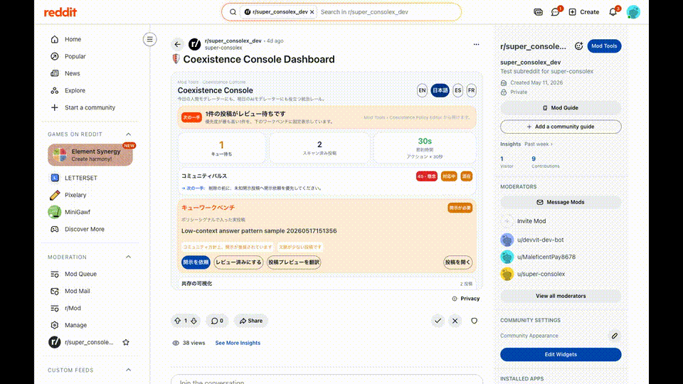
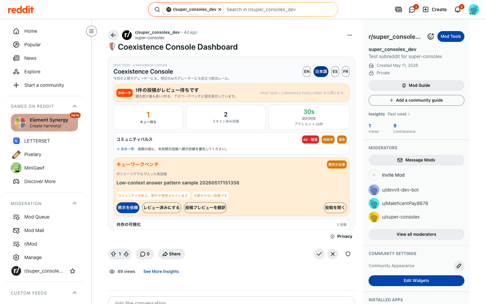
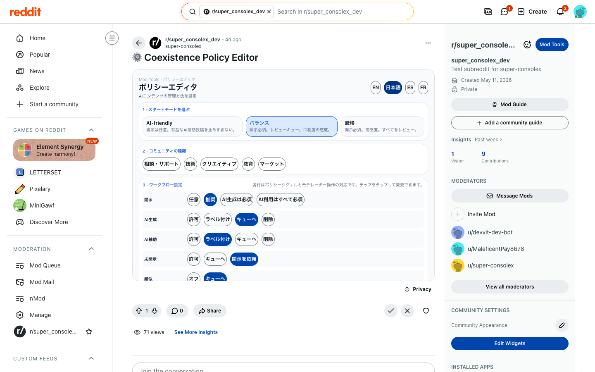
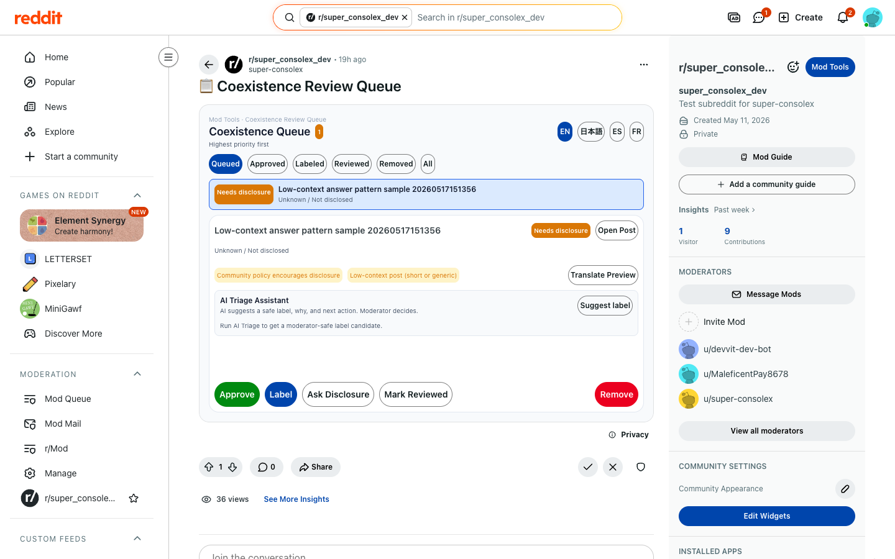
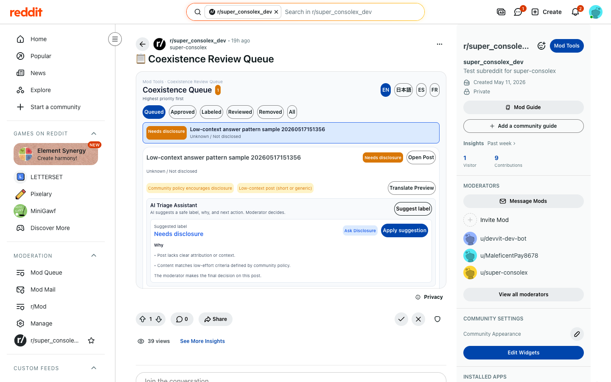
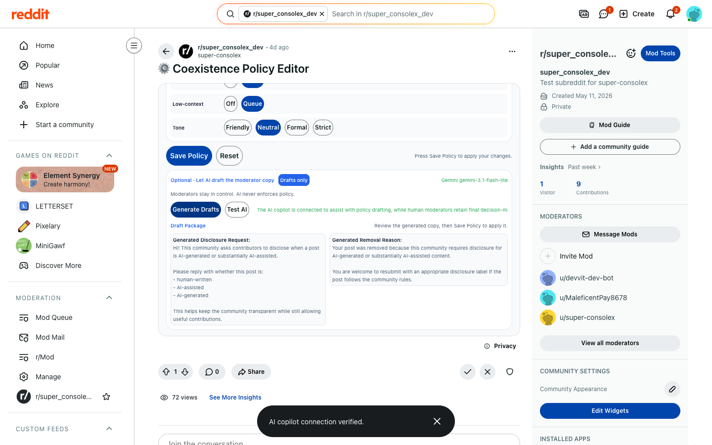
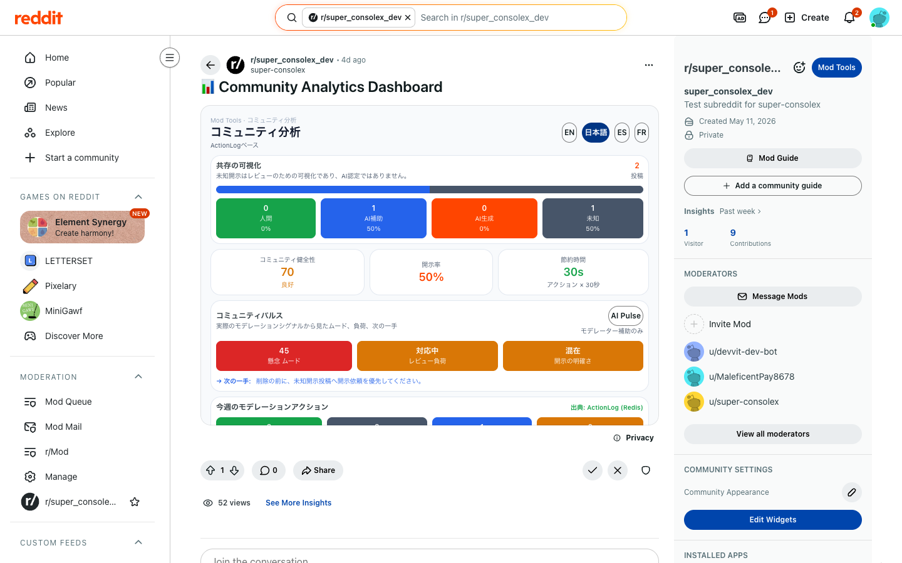
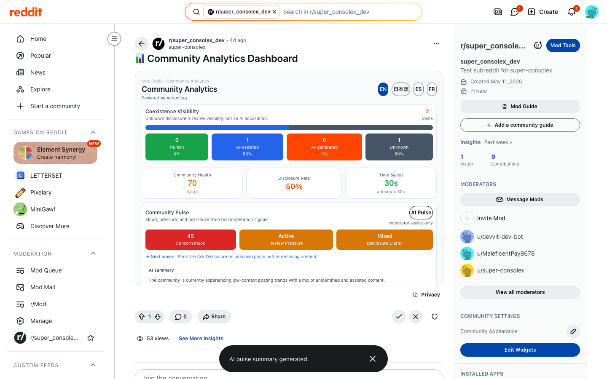
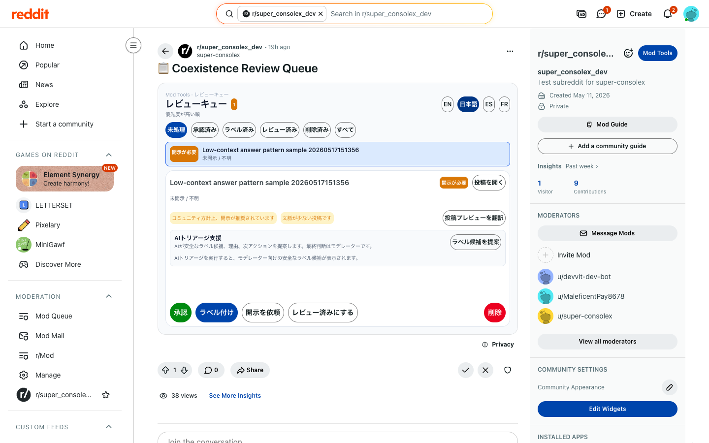

# Coexistence Console

> 今日の人間モデレーターにも、明日のAIモデレーターにも役立つ統治レール。

Coexistence Console は、AI補助投稿、AI生成投稿、人間の投稿、開示不明の投稿が同じコミュニティに混ざる時代のための Reddit Devvit モデレーションアプリです。

## 一言で

AIモデレーションは、単なる検出問題ではありません。ガバナンスの問題です。

Coexistence Console は、Reddit モデレーターが AI利用ポリシー、開示ルール、説明可能なレビューキュー、モデレーターアクション、ActionLogベースの分析を一貫して運用するためのコンソールです。

## まず見るもの

- 公開レビュー用GitHub: https://github.com/daideguchi/coexistence-console
- デモ動画: [media/demo-video-v050-overview.mp4](media/demo-video-v050-overview.mp4)
- 日本語ダッシュボード: [media/fresh-v047-ja-dashboard.png](media/fresh-v047-ja-dashboard.png)
- 日本語ポリシーエディタ: [media/fresh-v047-ja-policy.png](media/fresh-v047-ja-policy.png)
- 実Geminiのポリシー下書き: [media/fresh-v028-live-ai-policy-drafts.png](media/fresh-v028-live-ai-policy-drafts.png)
- AIトリアージ支援: [media/fresh-v050-live-ai-triage.png](media/fresh-v050-live-ai-triage.png)
- 提出前チェックリスト: [SUBMISSION_PREP.md](SUBMISSION_PREP.md)

## デモプレビュー

下のアニメーションをクリックすると、現在の概要デモ動画を開けます。

<p>
  <a href="media/demo-video-v050-overview.mp4">
    
  </a>
</p>

## スクリーンショット

<table>
  <tr>
    <td width="50%">
      <strong>日本語ダッシュボード</strong><br>
      
    </td>
    <td width="50%">
      <strong>ポリシーエディタ</strong><br>
      
    </td>
  </tr>
  <tr>
    <td width="50%">
      <strong>レビューキュー</strong><br>
      
    </td>
    <td width="50%">
      <strong>AIトリアージ支援</strong><br>
      
    </td>
  </tr>
  <tr>
    <td width="50%">
      <strong>実Geminiのポリシー下書き</strong><br>
      
    </td>
    <td width="50%">
      <strong>分析</strong><br>
      
    </td>
  </tr>
  <tr>
    <td width="50%">
      <strong>AI Pulse</strong><br>
      
    </td>
    <td width="50%">
      <strong>日本語レビューキュー</strong><br>
      
    </td>
  </tr>
</table>

## これはAI検出器ではない

このプロダクトは「この投稿はAIだ」と断定するツールではありません。

使わない言葉:

- AI detected
- confirmed AI
- fake human
- bot detected
- ban recommended

代わりに使う言葉:

- missing disclosure
- needs label
- policy mismatch
- self-disclosed AI-assisted
- self-disclosed AI-generated
- low-context post
- similar to recent posts
- unknown disclosure
- needs moderator review

目的は、AIか人間かを裁くことではなく、AIが混ざるコミュニティを透明に運用することです。

## 主な流れ

1. Policy Editor  
   AI-friendly / Balanced / Strict / Custom から出発し、コミュニティに合うAI利用ルールを作ります。

2. AI Policy Copilot  
   Gemini がポリシー文、開示依頼文、削除理由、sidebar/wiki 文、レビュー基準、推奨ワークフローを下書きします。必ずモデレーターが確認して保存します。

3. Rule-Based Review Queue  
   実際の subreddit 投稿を、決定論的なルールでレビューキューに入れます。AIスコアではなく、説明可能な理由を表示します。

4. AIトリアージ支援
   Gemini が安全なラベル候補、観測可能な理由2つ、次に取るべきモデレーター操作を提案します。AI判定ではなく提案だけで、最終判断は必ずモデレーターです。開示不明の投稿をAI補助・AI生成と決めつけることはありません。

5. Moderator Actions
   Approve / Apply label / Ask disclosure / Mark reviewed / Remove with reason を実投稿に対して実行し、ActionLog に保存します。

6. Analytics
   scanned posts、queue items、labels applied、disclosure requests、removals、approvals、reviewed posts、estimated time saved を ActionLog から表示します。

## 言語対応

- アプリUI: Auto / English / Japanese / Spanish / French
- 設定名: `ui_language`
- UI内の切替: `EN` / `日本語` などのボタン
- 検証コマンド: `npm run japanese:verify`

もしアプリ側の言語設定にアクセスできない場合は、ブラウザの翻訳機能で README や Devpost ページを読めます。

## ライブアプリ

- App name: `super-consolex`
- Devvit app page: https://developers.reddit.com/apps/super-consolex
- Playtest subreddit: `r/super_consolex_dev`
- 公開レビュー用GitHub: https://github.com/daideguchi/coexistence-console
- 確認済みアップロード版: `0.0.54`

Playtest URL が `403` になる場合は、Redditのログインアカウントに playtest 権限がない、または playtest セッションが有効でない可能性があります。公開レビューでは、このリポジトリ内のデモ動画とスクリーンショットを見てください。ライブ確認する場合は以下を使います。

```bash
npx devvit playtest super_consolex_dev
```

## 検証コマンド

```bash
npm install
npm run build
npx devvit view
npm run dashboard:verify
npm run queue:verify
npm run japanese:verify
node ops/verify-ai-live.mjs
```

最新確認では、build、Dashboard、Queue、日本語UI、Gemini AI機能（Policy Copilot / AIトリアージ / AI Pulse）の検証が通っています。

## デモギャラリー

最新概要動画:

[media/demo-preview-v050.gif](media/demo-preview-v050.gif)

[media/demo-video-v050-overview.mp4](media/demo-video-v050-overview.mp4)

日本語ダッシュボード:


ポリシーエディタ:


レビューキュー:


AIトリアージ支援:


実Geminiの下書き:


分析:


## 時間削減の算出式

```text
estimated time saved = one-click moderator actions x 30 seconds
```

scanned / queued は透明性のために記録しますが、時間削減には含めません。Approve、Apply label、Ask disclosure、Mark reviewed、Remove with reason を one-click moderator actions として数えます。

## 提出ストーリー

Coexistence Console は、AIを排除するためのツールではありません。

RedditにAIという新しい参加者が混ざる時代に、人間モデレーターがルール、開示、レビュー、判断、説明、分析を透明に運用するためのガバナンス基盤です。
