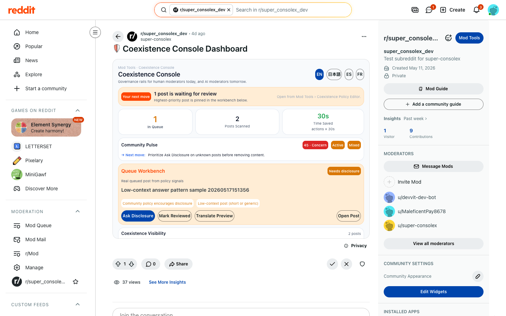

# Coexistence Console — Visual Usage Guide

## How to Use the App (Step by Step)

---

### 1. Dashboard Overview

**How to open:** Subreddit → 「…」Menu → "Open Coexistence Console"

What you see:
- **Next-Step Hero**: tells moderators what needs attention now
- **KPI Cards**: Queue | Scanned | Time Saved
- **Queue Workbench**: the highest-priority real queued post
- **Coexistence Visibility** and **Community Pulse**



**What to do here:**
- See the current moderation state at a glance
- Act on the Queue Workbench item
- Use Translate Preview for moderator understanding

---

### 2. Review Queue — Where Moderation Happens

**How to open:** Subreddit → 「…」Menu → "Open Coexistence Queue"

What you see:
- **Item List**: Posts sorted by policy priority and review status
- **Detail Panel**: Selected post info, signal explanation, and action buttons
- **Filter Buttons**: Queued | Approved | Labeled | Removed | All


**How to moderate:**
1. Look at the policy status and disclosure label
2. Click an item to see details
3. Review the signal explanation
4. Choose action:
   - **Label** → Applies a transparency label to the post
   - **Ask Disclosure** → Comments asking user to disclose
   - **Remove** → Removes post + auto-comment explaining why
   - **Approve** → Approves the post and clears it from the queue

---

### 3. Policy Editor — Configure Your Rules

**How to open:** Subreddit → 「…」Menu → "Open Policy Editor"

What you see:
- **Starting Mode Cards**: AI-friendly | Balanced | Strict
- **Community Type Pills**: Advice / Technical / Creative / Education / Marketplace
- **Disclosure Requirement**: Optional / Recommended / AI-generated required / All AI content required
- **Per-content actions**: Allow / Apply Label / Queue Review / Remove
- **Workflow Board**: seven rows of deterministic workflow settings
- **AI Policy Copilot**: Optional policy/template drafts when Gemini is configured
- **Community Pulse**: Aggregate mood, review pressure, disclosure clarity, and next move from real ActionLog and queue signals


**How to use:**
1. Pick a preset (most mods start with "Balanced")
2. Fine-tune individual settings
3. Click "Save Policy"
4. All future posts will use these rules

---

### 4. Analytics — Measure Impact

**How to open:** Subreddit → 「…」Menu → "Open Community Analytics"

What you see:
- **ActionLog Metrics**: scanned, queued, labeled, requests, approved, reviewed, removed
- **Estimated Time Saved**: one-click moderator actions × 30 seconds
- **Coexistence Visibility**: human / AI-assisted / AI-generated / unknown disclosure
- **AI Pulse**: optional Gemini summary of aggregate moderation signals


**Why this matters:**
- ActionLog proves the workflow is based on real mod work, not fake dashboard values
- Coexistence Visibility shows how participation modes are shaping the community
- Time Saved shows concrete moderator value

---

### 5. Disclosure Form — For Users

**How to open:** Subreddit → 「…」Menu → "Submit Post with AI Disclosure"

What you see:
- **Title input**: Post title
- **Body textarea**: Post content
- **Disclosure dropdown**:
  - Written entirely by me (no AI) → [HUMAN]
  - AI-assisted (I used AI tools) → [AI-ASSISTED]
  - AI-generated (AI created most) → [AI-GENERATED]


**What happens:**
1. User fills form and picks disclosure level
2. Post is published with auto-tag (e.g., "[AI-ASSISTED] My Title")
3. Disclosure metadata is stored in Redis
4. Post bypasses some scanning (already disclosed)

---

### Typical Moderation Workflow

```
1. User submits post (with or without disclosure)
2. System evaluates the post against local policy signals
3. Posts needing moderator attention appear in Review Queue
4. Moderator opens Queue → reviews signals → takes action
5. Dashboard & Analytics update automatically
```

### Quick Reference: Menu Locations

| Feature | Menu Path |
|---------|-----------|
| Dashboard | Subreddit → 「…」 → "Open Coexistence Console" |
| Review Queue | Subreddit → 「…」 → "Open Coexistence Queue" |
| Policy Editor | Subreddit → 「…」 → "Open Policy Editor" |
| Analytics | Subreddit → 「…」 → "Open Community Analytics" |
| Disclosure Form | Subreddit → 「…」 → "Submit Post with AI Disclosure" |

---

**Screenshots captured:** 2026-05-18
**App:** super-consolex v0.0.50
**Subreddit:** r/super_consolex_dev
